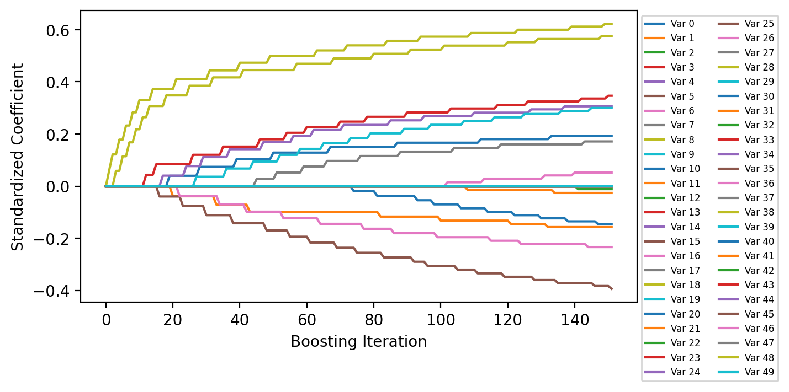

Alternative Fitting Procedure with Surrogate Loss Function
==========================================================

This example demonstrates an alternative way to fit a boosted model
using a for loop such that holdout loss functions amongst other things
can be customized.

.. code:: ipython3

    import numpy as np
    import pandas as pd
    import matplotlib.pyplot as plt

    from sklearn.datasets import make_classification
    from sklearn.preprocessing import scale
    from sklearn.model_selection import train_test_split
    from sklearn.metrics import roc_auc_score

    from genestboost import BoostedLinearModel
    from genestboost.weak_learners import SimplePLS
    from genestboost.link_functions import LogitLink
    from genestboost.loss_functions import LogLoss

    %matplotlib inline

Create a Dummy Classification Dataset
~~~~~~~~~~~~~~~~~~~~~~~~~~~~~~~~~~~~~

.. code:: ipython3

    X, y = make_classification(n_samples=20000,
                               n_features=50,
                               n_informative=20,
                               weights=(0.85, 0.15),
                               random_state=11,
                               shuffle=False)
    X = scale(X)

Alternative Fitting Procedure
~~~~~~~~~~~~~~~~~~~~~~~~~~~~~

.. code:: ipython3

    X_train, X_val, y_train, y_val = (
        train_test_split(X, y, test_size=0.30, stratify=y, random_state=13)
    )

    # notice no validation set arguments in the init - we will compute holdout in our loop below
    model = BoostedLinearModel(
        link=LogitLink(),
        loss=LogLoss(),
        model_callback=SimplePLS,   # for now, still need to specify this arg
        model_callback_kwargs={},
        alpha=5.0,
        step_type="decaying",
        weights="newton",)

    # HELPER
    def calc_roc(yp, yp_val):
        """Closure of y_train and y_val."""
        return (roc_auc_score(y_train, yp), roc_auc_score(y_val, yp_val))

    # instead of using fit, we will use a for-loop to fit the model while using
    # ROC-AUC on the holdout set to determine stoppage
    yp, eta_p = model.initialize_model(X_train, y_train)   ### IMPORTANT - initializes the model
    eta_p_val = model.decision_function(X_val)
    yp_val = model.compute_link(eta_p_val, inverse=True)
    loss_list = [calc_roc(yp, yp_val)]   # rocauc loss [(train, val)]

    # main loop
    max_iterations, min_iterations, iter_stop = 2000, 20, 20
    for i in range(max_iterations):
        yp, eta_p = model.boost(X_train, y_train, yp, eta_p, SimplePLS, {})
        eta_p_val += model.decision_function_single(X_val)   # predict on only the last model for performance
        yp_val = model.compute_link(eta_p_val, inverse=True)
        loss_list.append(calc_roc(yp, yp_val))

        if i >= min_iterations and i > iter_stop:
            loss_check = loss_list[-iter_stop][1]
            if loss_list[-1][1] < loss_check:
                break

    print("Number of Boosting Iterations: {:d}".format(model.get_iterations()))

.. parsed-literal::

    Number of Boosting Iterations: 151

Plot the loss history
~~~~~~~~~~~~~~~~~~~~~

.. code:: ipython3

    fig = plt.figure(figsize=(6.5, 3.5), dpi=200)
    ax = fig.add_subplot(111)
    ax.plot(np.array(loss_list), label=["Training", "Holdout"])
    ax.legend(loc="best")
    ax.set_ylabel("ROC AUC")
    ax.set_xlabel("Boosting Iteration");

Plot Coefficient History
~~~~~~~~~~~~~~~~~~~~~~~~

The coefficients are scaled by the standard deviation of the
corresponding features in the data set to get standardized coefficients.

.. code:: ipython3

    fig = plt.figure(figsize=(6.5, 3.5), dpi=200)
    ax = fig.add_subplot(111)
    ax.plot(model.get_coefficient_history(scale=X.std(ddof=1, axis=0)), label=[f"Var {i:d}" for i in range(X.shape[1])])
    ax.legend(loc="upper left", bbox_to_anchor=(1, 1), ncol=2, fontsize=6)
    ax.set_xlabel("Boosting Iteration")
    ax.set_ylabel("Standardized Coefficient");

.. image:: images/alternative_fit_coef_history.png

Order that Variables Entered the Model
~~~~~~~~~~~~~~~~~~~~~~~~~~~~~~~~~~~~~~

.. code:: ipython3

    print("Number of Selected Variables in the Model: {:d}".format(len(model.get_coefficient_order())))
    model.get_coefficient_order()

.. parsed-literal::

    Number of Selected Variables in the Model: 14

.. parsed-literal::

    [8, 18, 3, 5, 14, 0, 1, 6, 19, 17, 10, 16, 11, 2]
