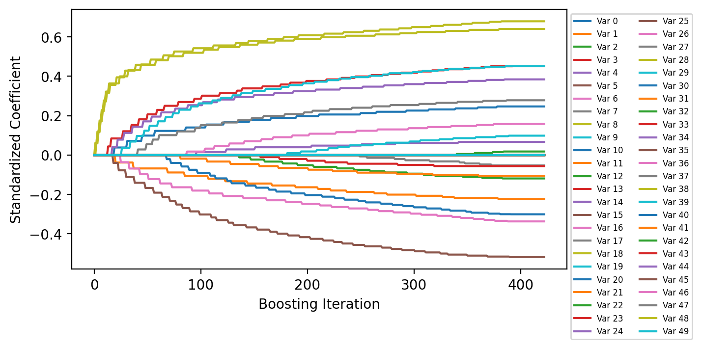

BoostedLinearModel with SimplePLS Algorithm Example
===================================================

This example demonstrates the use of the ``BoostedLinearModel`` class.
``BoostedLinearModel`` is a subclass of ``BoostedModel`` that takes
advantage of the fact that a sum of linear models is itself a linear
model. It also provides additional functionality pertaining to linear
models that can be used to help with variable selection.

To demonstrate, the ``SimplePLS`` modeling algorithm that is internal to
the library is used for boosting. ``SimplePLS`` by default will fit a
1-variable linear regression to a dataset, where the single feature used
will be the feature with the highest correlation with the target. Refer
to the documentation for additional arguments, which allow for the
specification of selecting more than one variable or filtering variables
that are not as correlated with the target as the most correlated
feature. Ill-conditioning due to multicollinearity is not an issue with
``SimplePLS``. Furthermore, looking at the order (i.e., the boosting
iteration) in which features enter the model provides a simple way to
select features.

Logistic regression will be performed in the example using the same
dataset that is used in the Binary Target example. Here though,
shuffling is turned off so that the informative features are placed as
the first columns in the returned dataset.

.. code:: ipython3

    import numpy as np
    import pandas as pd
    import matplotlib.pyplot as plt

    from sklearn.datasets import make_classification
    from sklearn.preprocessing import scale

    from genestboost import BoostedLinearModel
    from genestboost.weak_learners import SimplePLS
    from genestboost.link_functions import LogitLink
    from genestboost.loss_functions import LogLoss

    %matplotlib inline

Create a Dummy Classification Dataset
~~~~~~~~~~~~~~~~~~~~~~~~~~~~~~~~~~~~~

.. code:: ipython3

    X, y = make_classification(n_samples=20000,
                               n_features=50,
                               n_informative=20,
                               weights=(0.85, 0.15),
                               random_state=11,
                               shuffle=False)
    X = scale(X)

Fit the Model
~~~~~~~~~~~~~

.. code:: ipython3

    model = BoostedLinearModel(
        link=LogitLink(),
        loss=LogLoss(),
        model_callback=SimplePLS,
        model_callback_kwargs={},
        alpha=5.0,
        step_type="decaying",
        weights="newton",
        validation_fraction=0.30,
        validation_iter_stop=20,
        validation_stratify=True)
    model.fit(X, y, iterations=2000);

Plot the loss history
~~~~~~~~~~~~~~~~~~~~~

.. code:: ipython3

    fig = plt.figure(figsize=(6.5, 3.5), dpi=200)
    ax = fig.add_subplot(111)
    ax.plot(model.get_loss_history(), label=["Training", "Holdout"])
    ax.legend(loc="best");

.. image:: images/boosted_linear_model_loss_history.png

Plot Coefficient History
~~~~~~~~~~~~~~~~~~~~~~~~

The coefficients are scaled by the standard deviation of the
corresponding features in the data set to get standardized coefficients.

.. code:: ipython3

    fig = plt.figure(figsize=(6.5, 3.5), dpi=200)
    ax = fig.add_subplot(111)
    ax.plot(model.get_coefficient_history(scale=X.std(ddof=1, axis=0)), label=[f"Var {i:d}" for i in range(X.shape[1])])
    ax.legend(loc="upper left", bbox_to_anchor=(1, 1), ncol=2, fontsize=6)
    ax.set_xlabel("Boosting Iteration")
    ax.set_ylabel("Standardized Coefficient");

Order that Variables Entered the Model
~~~~~~~~~~~~~~~~~~~~~~~~~~~~~~~~~~~~~~

.. code:: ipython3

    print("Number of Selected Variables in the Model: {:d}".format(len(model.get_coefficient_order())))
    model.get_coefficient_order()

.. parsed-literal::

    Number of Selected Variables in the Model: 19

.. parsed-literal::

    [8, 18, 3, 14, 5, 0, 1, 6, 19, 17, 10, 11, 16, 4, 2, 13, 9, 7, 12]

.. code:: ipython3

    # Order by index number - 19 of the first 20 variables are selected (informative features)
    sorted(model.get_coefficient_order())

.. parsed-literal::

    [0, 1, 2, 3, 4, 5, 6, 7, 8, 9, 10, 11, 12, 13, 14, 16, 17, 18, 19]
