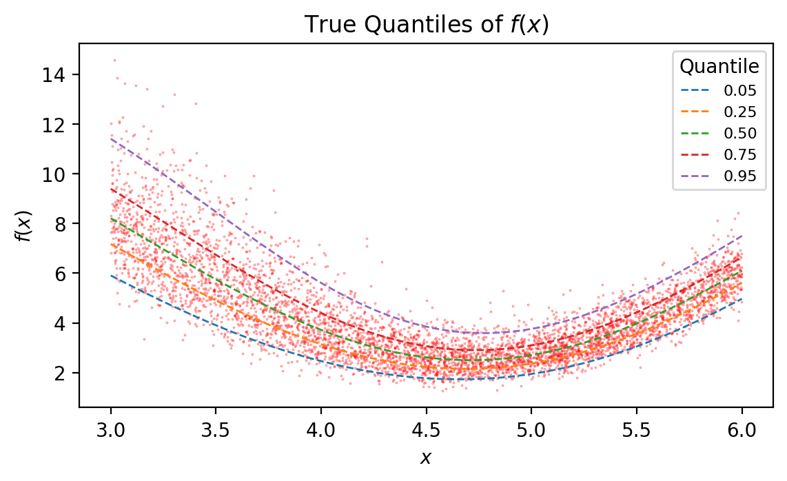

Quantile Regression with Different Algorithms
=============================================

Fit quantiles of a non-linear 1D function using ensembles different
model algorithms.

.. code:: ipython3

    import numpy as np
    import pandas as pd
    import matplotlib.pyplot as plt
    import scipy.stats as scst

    from genestboost import BoostedModel
    from genestboost.link_functions import IdentityLink
    from genestboost.loss_functions import QuantileLoss

    %matplotlib inline

Create a Random Function and Generate Data Points
~~~~~~~~~~~~~~~~~~~~~~~~~~~~~~~~~~~~~~~~~~~~~~~~~

Below, 5000 points are generated according to the following function
specification:

.. math::  f(x) = (5.0 \cdot sin(x) + 7.5) \cdot \epsilon

.. math::  \epsilon = lognormal \left( 0.0, \frac{1.0}{(x - 4.0)^2 + 4.0} \right)

.. code:: ipython3

    # generate random data
    def e(x):
        """Compute lognormal sigma as a function of x."""
        return 1.0 / ((x - 4.0) ** 2 + 4.0)

    np.random.seed(17)
    x = np.random.uniform(3.0, 6.0, size=5000)
    error = np.random.lognormal(mean=0.0, sigma=e(x))
    y = (5.0 * np.sin(x) + 7.5) * error

    # plot true quantiles
    fig = plt.figure(figsize=(6.5, 3.5), dpi=200)
    ax = fig.add_subplot(111)
    ax.scatter(x, y, s=0.1, color="red", alpha=0.5)

    quantiles = [0.05, 0.25, 0.50, 0.75, 0.95]
    xs = np.linspace(3.0, 6.0, 1001)
    es = e(xs)
    band_list = list()
    for i, q in enumerate(quantiles):
        values = (5.0 * np.sin(xs) + 7.5) * scst.lognorm.ppf(q, es)
        band_list.append(values)
        ax.plot(xs, values, linestyle="--", linewidth=1.0, label=f"{q:0.2f}")

    ax.legend(loc="best", title="Quantile", fontsize=8)
    ax.set_ylabel("$f(x)$")
    ax.set_xlabel("$x$")
    ax.set_title("True Quantiles of $f(x)$");

Specify different modeling algorithms
~~~~~~~~~~~~~~~~~~~~~~~~~~~~~~~~~~~~~

Parameters here are arbitrary. There is no tuning or CV performed.

.. code:: ipython3

    from sklearn.neural_network import MLPRegressor
    from sklearn.tree import DecisionTreeRegressor
    from sklearn.ensemble import RandomForestRegressor
    from sklearn.gaussian_process import GaussianProcessRegressor
    from sklearn.neighbors import KNeighborsRegressor

    # create list of different model algorithm callbacks with some kwargs
    # note: no tuning/CV has been done here
    model_names = [
        "Neural Network",
        "Decision Tree",
        "Random Forest",
        "Gaussian Process",
        "KNeighbors Regressor",
    ]

    model_list = [
        {
            "model_callback": MLPRegressor,
            "model_callback_kwargs": {"hidden_layer_sizes": (16, 8, 4),
                                      "max_iter": 1000,
                                      "alpha": 0.02,}
        },
        {
            "model_callback": DecisionTreeRegressor,
            "model_callback_kwargs": {"splitter": "random",
                                      "max_depth": 3,
                                      "min_samples_split": 25,}
        },
        {
            "model_callback": RandomForestRegressor,
            "model_callback_kwargs": {"n_estimators": 10,
                                      "min_samples_split": 30,
                                      "max_depth": 3,}
        },
        {
            "model_callback": GaussianProcessRegressor,
            "model_callback_kwargs": None
        },
        {
            "model_callback": KNeighborsRegressor,
            "model_callback_kwargs": {"n_neighbors": 100,}
        },
    ]

Fit the model ensembles
~~~~~~~~~~~~~~~~~~~~~~~

.. code:: ipython3

    # fit models
    model_results_list = list()
    for i, (q, kwargs) in enumerate(zip(quantiles, model_list)):
        print("Fitting ensemble of {:s} models...".format(model_names[i]))
        model = BoostedModel(
            link=IdentityLink(),
            loss=QuantileLoss(q),
            weights="none",
            alpha=0.2,
            step_type="constant",
            validation_fraction=0.15,
            validation_iter_stop=20,
            **kwargs
        )
        model.fit(x.reshape((-1, 1)), y, iterations=500)
        preds = model.predict(xs.reshape((-1, 1)))
        model_results_list.append((model, preds))

.. parsed-literal::

    Fitting ensemble of Neural Network models...
    Fitting ensemble of Decision Tree models...
    Fitting ensemble of Random Forest models...
    Fitting ensemble of Gaussian Process models...
    Fitting ensemble of KNeighbors Regressor models...

Plot the results
~~~~~~~~~~~~~~~~

.. code:: ipython3

    fig = plt.figure(figsize=(6.5, 3.5), dpi=200)
    ax = fig.add_subplot(111)
    ax.scatter(x, y, s=0.1, color="red", alpha=0.75)

    colors = ["black", "blue", "green", "yellow", "purple"]
    for i, (model, preds) in enumerate(model_results_list):
        q, model_name = quantiles[i], model_names[i]
        label = f"{q:0.02f} - {model_name} Ensemble"
        ax.plot(
            xs, band_list[i],
            color=colors[i],
            linestyle="--",
            label="__nolegend__"
        )
        ax.plot(xs, preds, color=colors[i], label=label, linewidth=1)
    ax.legend(loc="best", title="Quantile", fontsize=8)
    ax.set_ylabel("$f(x)$")
    ax.set_xlabel("$x$")
    ax.set_title("Quantile Regression Using Different Algorithms")
    ax.text(3, 14,
            r"$f(x) = (5.0 \cdot sin(x) + 7.5) \cdot \epsilon$",
            fontsize=8,
    )
    ax.text(3, 13,
            r"$ \epsilon = LN \left( 0.0, \frac{1.0}{(x - 4.0)^2 + 4.0} \right) $",
            fontsize=8,
    );

.. image:: images/qr_different_alg_plot.png

Model Iterations
~~~~~~~~~~~~~~~~

.. code:: ipython3

    for i, (model, preds) in enumerate(model_results_list):
        print("{:s}: {:d} iterations".format(model_names[i], model.get_iterations()))

.. parsed-literal::

    Neural Network: 310 iterations
    Decision Tree: 96 iterations
    Random Forest: 94 iterations
    Gaussian Process: 95 iterations
    KNeighbors Regressor: 170 iterations
